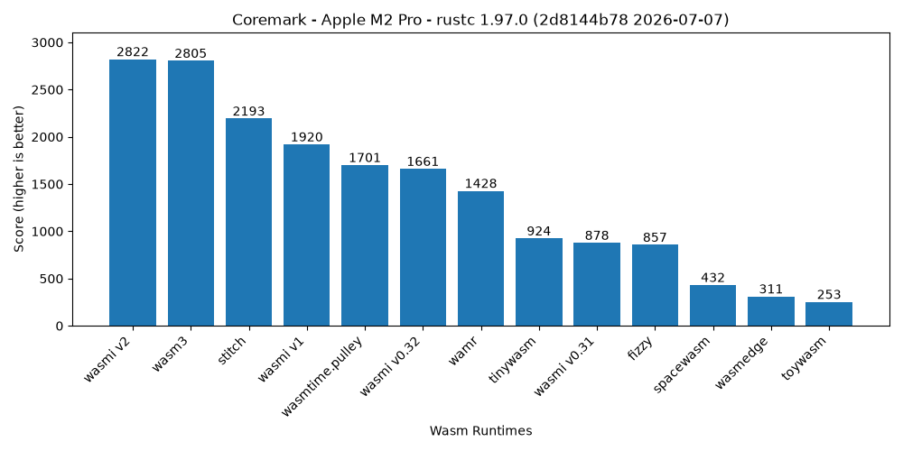
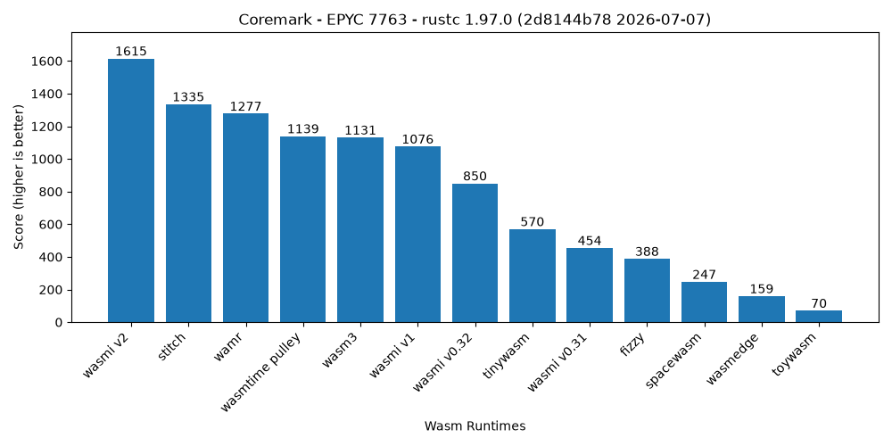

# Wasmi Benchmarking Suite

This includes execution and compilation benchmarks for the Wasmi interpreter and other Wasm runtimes.

## Runtimes

The following Wasm runtimes and configurations are included.

| Runtime | Kind | Configurations | Description |
|:-------:|:--------------:|:-----|:---|
| [`wasmi-v0.31`][Wasmi v0.31] | Interpreter | | The old version of the Wasmi Wasm stack-machine interpreter. |
| [`wasmi-v1`][Wasmi v1] | Interpreter | `eager`<br>`eager.unchecked`<br>`lazy`<br>`lazy.unchecked`<br>`lazy-translation` | The Wasmi v1 interpreter.  |
| [`wasmi-v2`][Wasmi v2] | Interpreter | `eager`<br>`eager.unchecked`<br>`lazy`<br>`lazy.unchecked`<br>`lazy-translation` | The new and experimental Wasmi v2 interpreter with its various optimizations. |
| [`wasmtime.cranelift`][Wasmtime] | Optimizing JIT | | Wasmtime's optimizing JIT backend for the fastest performance. |
| [`wasmtime.winch`][Wasmtime] | Baseline JIT | | Wasmtime's baseline JIT for faster startup performance. |
| [`wasmtime.pulley`][Wasmtime] | Interpreter | | Wasmtime's portable interpreter backend. |
| [`wasmer.cranelift`][Wasmer] | Optimizing JIT | | Wasmer's optimizing JIT backend based on Cranelift. |
| [`wasmer.singlepass`][Wasmer] | Baseline JIT | | Wasmer's baseline JIT for faster startup performance. |
| [`v8`][V8] | Multi-Tier JIT | | Google's high performance JS runtime. |
| [`wasm3`][Wasm3] | Interpreter | `eager`<br>`lazy` | A fast and well-established Wasm interpreter. |
| [`stitch`][Stitch] | Interpreter | | Experimental and very fast zero-dependencies Wasm interpreter. |
| [`wamr`][WAMR] | Interpreter | | The WebAssembly Micro Runtime (WAMR) fast interpreter. |
| [`tinywasm`][Tinywasm] | Interpreter | | Wasm interpreter written in pure safe Rust. |
| [`toywasm`][Toywasm] | Interpreter | | Feature-rich in-place WebAssembly interpreter with low memory usage. |
| [`spacewasm`][SpaceWasm] | Interpreter | | NASA JPL's `no_std` Wasm 1.0 (MVP) interpreter for on-board spacecraft use. |
| [`wasmedge`][WasmEdge] | Interpreter | | The interpreter of the WasmEdge Wasm runtime. |
| [`fizzy`][Fizzy] | Interpreter | | A fast, deterministic, and pedantic WebAssembly interpreter. |

**Missing Wasm runtimes:** [Wain], [DLR-wasm-interpreter]

[Wasmi v0.31]: https://github.com/wasmi-labs/wasmi/tree/v0.31.2
[Wasmi v1]: https://github.com/wasmi-labs/wasmi/tree/v1.0.9
[Wasmi v2]: https://github.com/wasmi-labs/wasmi/tree/v2.0.0-beta.7
[WAMR]: https://github.com/bytecodealliance/wasm-micro-runtime
[Toywasm]: https://github.com/yamt/toywasm
[Wain]: https://github.com/rhysd/wain
[Tinywasm]: https://github.com/explodingcamera/tinywasm
[Wasm3]: https://github.com/wasm3/wasm3
[Wasmtime]: https://github.com/bytecodealliance/wasmtime
[Wasmer]: https://github.com/wasmerio/wasmer
[Stitch]: https://github.com/makepad/stitch
[SpaceWasm]: https://github.com/nasa/spacewasm
[WasmEdge]: https://github.com/wasmedge/wasmedge
[V8]: https://github.com/v8/v8
[DLR-wasm-interpreter]: https://github.com/DLR-FT/wasm-interpreter
[Fizzy]: https://github.com/wasmx/fizzy

### Configuration Explanation

- `eager`: All function bodies are compiled and validated immediately.
- `eager.unchecked`: Function bodies are compiled eagerly but Wasm validation is skipped.
- `lazy`: Function bodies are only compiled and validated upon first use.
- `lazy.unchecked`: Function bodies are only compiled upon first use and Wasm validation is skipped.
- `lazy-translation`: Function bodies are lazily compiled but eagerly validated.

**Note:** by default runtimes compile and validate function bodies eagerly.

## Usage

Run all benchmarks via:

```
cargo bench
```

**Note:** compilation might take some minutes since we are compiling a lot of Wasm runtimes with very high optimization settings.

Filter benchmarks via

- `startup`: for startup (compile + instantiate) benchmarks.
- `execute`: for execution benchmarks.
- The runtime `ID`, e.g. `wasmi-v0.31` or `wasm3`.
- The runtime configuration on top of the runtime `ID`, e.g. `wasmi-v0.32.lazy`.
- Single test names, e.g. `counter` (execute) or `ffmpeg` (startup)

Examples

Run all runtimes on the `counter` execution benchmark test case:

```
cargo bench execute/counter
```

Run all Wasm3 test cases with its eager compilation configuration:

```
cargo bench wasm3.eager
```

## Test Cases

### Execution Benchmarks

Tests the execution performance of the Wasm runtime, prefixed by `execute/`.

| Test Case | Description |
|:--|:--|
| `counter-local` | Simple loop that counts a single local down from some number. |
| `counter-param` | Simple loop that counts down from some number via a control parameter. |
| `counter-global` | Simple loop that counts a global down from some number. |
| `fibonacci-rec` | Recursive fibonacci calculation. Call-intense workload. |
| `fibonacci-iter` | Iterative fibonacci calculation. Compute intense workload. |
| `fibonacci-tail` | Tail-call based fibonacci calculation. |
| `sort`   | Executes Rust's standard [`sort_unstable`] on integers. |
| `prime_sieve` | Executes a Rust sieve of eratosthenes implementation. |
| `matrix_mul` | Naive matrix multiplication implementation. Makes heavy use of linear memory and floats. |
| `nbody` | N-body physics simulation. |
| `argon2` | Password hashing library. Compute- and memory intense workload. |
| `tiny_keccak`| Tiny Rust implementation of Keccak crptography hashing. |
| `mandelbrot` | Classic Rust mandelbrot implementation. |
| `spectralnorm` | Computes the eigenvalue using the power method. |
| `compression`| Compresses some input using the `miniz_oxide` crate. |
| `word_count` | Count unqiue words in a string input via hash table inserts and look-ups. |
| `json_parse` | Parses a JSON file using `serde_json`. |
| `reverse_complement` | Converts a DNA sequence into its reverse, complement. |
| `regex_redux` | Match DNA 8-mers and substitute magic patterns. |
| `bulk-ops` | Tests performance of `memory.{copy,fill}` from the Wasm [`bulk-memory-operations`] proposal. |

### Startup Benchmarks

Tests the startup performance of the Wasm runtime, prefixed by `startup/`.

| Test Case | Description |
|:--|:--|
| `bz2` | Medium-sized compression library with huge function bodies. (WASI required) |
| `pulldown-cmark` | Medium-sized markdown renderer. (WASI required) |
| `spidermonkey` | The firefox Javascript execution engine. (large, WASI required) |
| `ffmpeg` | Huge multimedia library. (WASI required) |
| `coremark` | CoreMark benchmarking compilation. (kinda small, no WASI) |
| `argon2` | Password hashing library. (small, no WASI) |
| `erc20` | ink! based ERC-20 implementation. (tiny, no WASI) |

[`bulk-memory-operations`]: https://github.com/WebAssembly/bulk-memory-operations
[`sort_unstable`]: https://doc.rust-lang.org/std/primitive.slice.html#method.sort_unstable

## Coremark

This benchmark suite also contains a Coremark test which can be run via

```
cargo run --profile bench
```

This will run Coremark using all available Wasm VMs and print their Coremark scores to the console.

<p align="center">
  <a href="./data/apple-m2-pro/coremark.csv">
    
  </a>
  <a href="./data/amd-epyc-7763/coremark.csv">
    
  </a>
</p>

## Plotting

In order to run the benchmarks and simultaneously plot diagrams of their results use the following command:

```
cargo criterion --bench criterion --message-format=json | cargo run --bin plot
```

This generates plots in the `target/wasmi-benchmarks` folder for all the benchmark groups.
In order to use this you may need to install `cargo-criterion` via `cargo install cargo-criterion`.

In case you want to collect data first and plot later you can also instead store
the benchmark results into a file and use the file to plot the data later:

```
cargo criterion --bench criterion --message-format=json > results.json
cat results.json | cargo run --bin plot
```

## Runtime & Benchmark Support

Not every Wasm runtime can run every benchmark test case: some lack support for
Wasm proposals used by a test case, and some fail to instantiate certain modules.
The matrices below show which `execute` and `startup` test cases each runtime
supports. A ✅ means the runtime runs the test case, a ❌ means it does not.
These are derived directly from each runtime's `can_run` implementation (under
`runtimes/*/lib.rs`); runtimes without a `can_run` run every test case.

### Execution Support

| Test Case | wasmi<br>v0.31 | wasmi<br>v0.32 | wasmi<br>v1 | wasmi<br>v2 | wasmtime<br>cranelift | wasmtime<br>winch | wasmtime<br>pulley | wasmer<br>cranelift | wasmer<br>singlepass | v8 | wasm3 | stitch | wamr | tinywasm | toywasm | spacewasm | wasmedge | fizzy | dlr-wasm-interpreter |
|:--|:--:|:--:|:--:|:--:|:--:|:--:|:--:|:--:|:--:|:--:|:--:|:--:|:--:|:--:|:--:|:--:|:--:|:--:|:--:|
| `counter-local` | ✅ | ✅ | ✅ | ✅ | ✅ | ✅ | ✅ | ✅ | ✅ | ✅ | ✅ | ✅ | ✅ | ✅ | ✅ | ✅ | ✅ | ✅ | ✅ |
| `counter-param` | ✅ | ✅ | ✅ | ✅ | ✅ | ✅ | ✅ | ✅ | ✅ | ✅ | ✅ | ✅ | ✅ | ✅ | ✅ | ❌ | ✅ | ❌ | ✅ |
| `counter-global` | ✅ | ✅ | ✅ | ✅ | ✅ | ✅ | ✅ | ✅ | ✅ | ✅ | ✅ | ✅ | ✅ | ✅ | ✅ | ✅ | ✅ | ✅ | ✅ |
| `fibonacci-rec` | ✅ | ✅ | ✅ | ✅ | ✅ | ✅ | ✅ | ✅ | ✅ | ✅ | ✅ | ✅ | ✅ | ✅ | ✅ | ✅ | ✅ | ✅ | ✅ |
| `fibonacci-iter` | ✅ | ✅ | ✅ | ✅ | ✅ | ✅ | ✅ | ✅ | ✅ | ✅ | ✅ | ✅ | ✅ | ✅ | ✅ | ✅ | ✅ | ✅ | ✅ |
| `fibonacci-tail` | ✅ | ✅ | ✅ | ✅ | ✅ | ❌ | ✅ | ❌ | ❌ | ✅ | ❌ | ❌ | ✅ | ✅ | ✅ | ❌ | ✅ | ❌ | ❌ |
| `sort` | ✅ | ✅ | ✅ | ✅ | ✅ | ✅ | ✅ | ✅ | ✅ | ✅ | ✅ | ❌ | ✅ | ✅ | ✅ | ✅ | ✅ | ✅ | ✅ |
| `prime_sieve` | ✅ | ✅ | ✅ | ✅ | ✅ | ✅ | ✅ | ✅ | ✅ | ✅ | ✅ | ❌ | ✅ | ✅ | ✅ | ✅ | ✅ | ✅ | ✅ |
| `matrix_mul` | ✅ | ✅ | ✅ | ✅ | ✅ | ✅ | ✅ | ✅ | ✅ | ✅ | ✅ | ❌ | ✅ | ✅ | ✅ | ✅ | ✅ | ✅ | ✅ |
| `nbody` | ✅ | ✅ | ✅ | ✅ | ✅ | ✅ | ✅ | ✅ | ✅ | ✅ | ✅ | ❌ | ✅ | ✅ | ✅ | ✅ | ✅ | ✅ | ✅ |
| `argon2` | ✅ | ✅ | ✅ | ✅ | ✅ | ✅ | ✅ | ✅ | ✅ | ✅ | ✅ | ❌ | ✅ | ✅ | ✅ | ✅ | ✅ | ✅ | ✅ |
| `tiny_keccak` | ✅ | ✅ | ✅ | ✅ | ✅ | ✅ | ✅ | ✅ | ✅ | ✅ | ✅ | ❌ | ✅ | ✅ | ✅ | ✅ | ✅ | ✅ | ✅ |
| `mandelbrot` | ✅ | ✅ | ✅ | ✅ | ✅ | ✅ | ✅ | ✅ | ✅ | ✅ | ✅ | ❌ | ✅ | ✅ | ✅ | ✅ | ✅ | ✅ | ✅ |
| `spectralnorm` | ✅ | ✅ | ✅ | ✅ | ✅ | ✅ | ✅ | ✅ | ✅ | ✅ | ✅ | ❌ | ✅ | ✅ | ✅ | ✅ | ✅ | ✅ | ✅ |
| `compression` | ✅ | ✅ | ✅ | ✅ | ✅ | ✅ | ✅ | ✅ | ✅ | ✅ | ✅ | ❌ | ✅ | ❌ | ✅ | ✅ | ✅ | ✅ | ✅ |
| `word_count` | ✅ | ✅ | ✅ | ✅ | ✅ | ✅ | ✅ | ✅ | ✅ | ✅ | ✅ | ❌ | ✅ | ✅ | ✅ | ✅ | ✅ | ✅ | ✅ |
| `json_parse` | ✅ | ✅ | ✅ | ✅ | ✅ | ✅ | ✅ | ✅ | ✅ | ✅ | ✅ | ❌ | ✅ | ✅ | ✅ | ✅ | ✅ | ✅ | ✅ |
| `reverse_complement` | ✅ | ✅ | ✅ | ✅ | ✅ | ✅ | ✅ | ✅ | ✅ | ✅ | ✅ | ❌ | ✅ | ✅ | ✅ | ✅ | ✅ | ✅ | ✅ |
| `regex_redux` | ✅ | ✅ | ✅ | ✅ | ✅ | ✅ | ✅ | ✅ | ✅ | ✅ | ✅ | ❌ | ✅ | ❌ | ✅ | ✅ | ✅ | ✅ | ✅ |
| `bulk-ops` | ✅ | ✅ | ✅ | ✅ | ✅ | ✅ | ✅ | ✅ | ✅ | ✅ | ✅ | ✅ | ✅ | ✅ | ✅ | ❌ | ✅ | ❌ | ✅ |

### Startup Support

| Test Case | wasmi<br>v0.31 | wasmi<br>v0.32 | wasmi<br>v1 | wasmi<br>v2 | wasmtime<br>cranelift | wasmtime<br>winch | wasmtime<br>pulley | wasmer<br>cranelift | wasmer<br>singlepass | v8 | wasm3 | stitch | wamr | tinywasm | toywasm | spacewasm | wasmedge | fizzy | dlr-wasm-interpreter |
|:--|:--:|:--:|:--:|:--:|:--:|:--:|:--:|:--:|:--:|:--:|:--:|:--:|:--:|:--:|:--:|:--:|:--:|:--:|:--:|
| `bz2` | ✅ | ✅ | ✅ | ✅ | ✅ | ✅ | ✅ | ✅ | ✅ | ✅ | ✅ | ✅ | ✅ | ❌ | ✅ | ✅ | ✅ | ✅ | ✅ |
| `pulldown-cmark` | ✅ | ✅ | ✅ | ✅ | ✅ | ✅ | ✅ | ✅ | ✅ | ✅ | ✅ | ✅ | ✅ | ❌ | ✅ | ✅ | ✅ | ✅ | ✅ |
| `spidermonkey` | ✅ | ✅ | ✅ | ✅ | ✅ | ✅ | ✅ | ✅ | ✅ | ✅ | ✅ | ✅ | ✅ | ❌ | ✅ | ✅ | ✅ | ✅ | ✅ |
| `ffmpeg` | ✅ | ✅ | ✅ | ✅ | ❌ | ✅ | ❌ | ✅ | ✅ | ✅ | ✅ | ❌ | ✅ | ❌ | ✅ | ✅ | ✅ | ✅ | ✅ |
| `coremark` | ✅ | ✅ | ✅ | ✅ | ✅ | ✅ | ✅ | ✅ | ✅ | ✅ | ✅ | ✅ | ✅ | ✅ | ✅ | ✅ | ✅ | ✅ | ✅ |
| `argon2` | ✅ | ✅ | ✅ | ✅ | ✅ | ✅ | ✅ | ✅ | ✅ | ✅ | ✅ | ✅ | ✅ | ✅ | ✅ | ✅ | ✅ | ✅ | ✅ |
| `erc20` | ✅ | ✅ | ✅ | ✅ | ✅ | ✅ | ✅ | ✅ | ✅ | ✅ | ✅ | ✅ | ✅ | ✅ | ✅ | ✅ | ✅ | ✅ | ✅ |

**Note:** `wasmtime.winch` only runs on `x86_64` and `aarch64`; this matrix assumes such a host. On other architectures it supports no test cases.

## License

Licensed under either of

  * Apache License, Version 2.0, ([LICENSE-APACHE](LICENSE-APACHE) or <http://www.apache.org/licenses/LICENSE-2.0>)
  * MIT license ([LICENSE-MIT](LICENSE-MIT) or <http://opensource.org/licenses/MIT>)

at your option.

## Contribution

Unless you explicitly state otherwise, any contribution intentionally submitted for inclusion in the work by you, as defined in the Apache-2.0 license, shall be dual licensed as above, without any additional terms or conditions.
